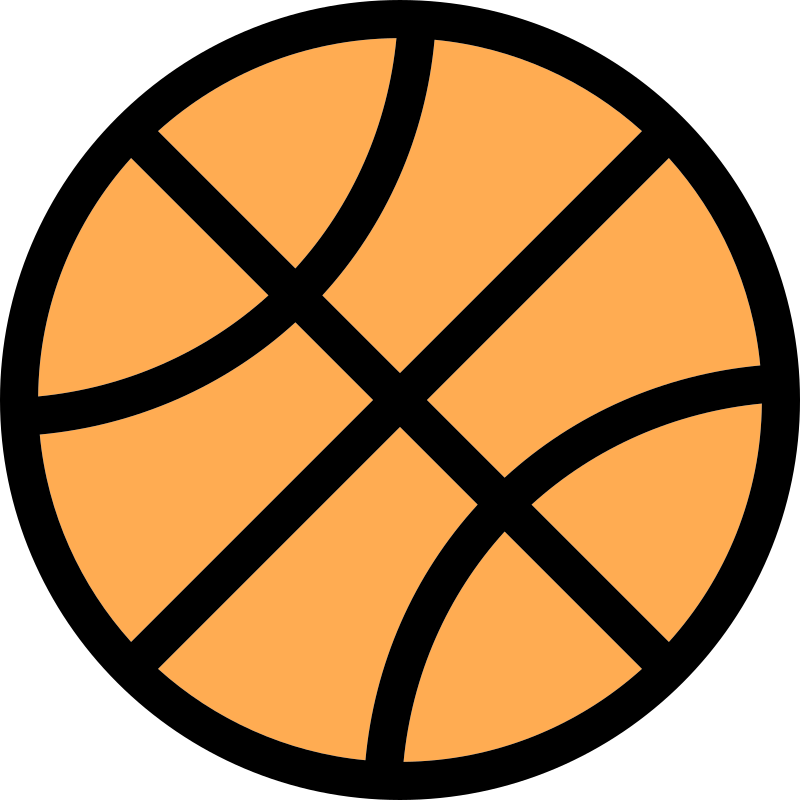

# Pickup Sportz App
<a id="readme-top"></a>
<!-- PROJECT LOGO -->
<br />
<div align="center">
  <a href="https://github.com/game_finder">
    
  </a>

  <h3 align="center">Pickup Sportz</h3>

  <p align="center">
    A social platform for connecting  <a href="https://en.wikipedia.org/wiki/Pick-up_game"><strong>pick up game</strong></a> participants.
    <br />
  </p>
</div>


<!-- TABLE OF CONTENTS -->
<details>
  <summary>Table of Contents</summary>
  <ol>
    <li>
      <a href="#about-the-project">About The Project</a>
      <ul>
        <li><a href="#built-with">Built With</a></li>
      </ul>
    </li>
    <li>
      <a href="#getting-started">Getting Started</a>
      <ul>
        <li><a href="#prerequisites">Prerequisites</a></li>
        <li><a href="#installation">Installation</a></li>
      </ul>
    </li>
    <li><a href="#usage">Usage</a></li>
    <li><a href="#roadmap">Roadmap</a></li>
    <li><a href="#license">License</a></li>
    <li><a href="#contact">Contact</a></li>
    <li><a href="#acknowledgments">Acknowledgments</a></li>
  </ol>
</details>


<!-- ABOUT THE PROJECT -->
## About The Project

![Join Event Animation][join-event-animation]

A fun team project to practice full stack development with MERN stack. While many see pickup sports as a form of "Spontaneous Urban Culture" we wanted trade some of the *spontaneity* for *reliability* with this web app.
* All users can create events
* Event creator can also edit the event
* Events are held in reuseable locations (separate DB table)
* Users can join events or drop events from their schedule
* Users who have joined an event can chat about the event
* Users who have joined an event see a notification if there is chat activity about that event
* The detail page for the event also shows the weather forecast for that area (using OpenWeatherMap API) 

<p align="right">(<a href="#readme-top">back to top</a>)</p>


### Built With

* [![React][React.js]][React-url]
* [![TailwindCSS][TailwindCSS.com]][Tailwind-url]
* [![Express][ExpressJS.com]][Express-url]
* [![MongoDB][MongoDB.com]][Mongo-url]


<p align="right">(<a href="#readme-top">back to top</a>)</p>


<!-- GETTING STARTED -->
## Getting Started

**NOTE**: *This project is not complete and served strictly as group learning project.*\
To get a local copy up and running follow these steps.

### Prerequisites

Node and NPM are required.
  ```sh
  npm install npm@latest -g
  ```

### Installation

**NOTE:** _This was a learning project and not in any way a finished, secure or stable application._

1. Clone the repo
   ```sh
   git clone https://github.com/tonyb650/game-finder.git
   ```
2. Install NPM packages for `server` and `client` folders
   ```sh
   npm install
   ```
3. Create database with Mongo Community Edition or MongoDB Atlas
4. Create `server/.env` file and populate with environment variables
   ```json
    ACCESS_TOKEN_SECRET="random_string_of_characters"
    REFRESH_TOKEN_SECRET="random_string_of_characters"
    MONGO_USERNAME="username"
    MONGO_PASSWORD="password"
    SERVER_PORT=8000
   ```
5. Create `client/.env` file and populate with environment OpenWeatherMap API key
    ```json
    VITE_REACT_APP_API_KEY="your_open_weather_map_api_key"
    ```
6. Update the DB connection string in `server/config/mongoDB.config.ts` to reflect the MongoDB you are connecting to.
7. Change git remote url to avoid accidental pushes to base project
   ```sh
   git remote set-url origin github_username/repo_name
   git remote -v # confirm the changes
   ```
8. Run scripts `npm run dev` for both server and client apps.

<p align="right">(<a href="#readme-top">back to top</a>)</p>


<!-- USAGE EXAMPLES -->
## Usage

### Adding Events
![Add Event Animation][add-event-animation]
### Chat About Events
![Event Chat Animation][event-chat-animation]
### View Event Details
![Event Details Screen Shot][event-details-screenshot]
### Search Events
![Search Events Animation][search-events-animation]
### User Registration and Login
![User Login Screen Shot][user-login-screenshot]
![User Register Screen Shot][user-register-screenshot]

<p align="right">(<a href="#readme-top">back to top</a>)</p>


<!-- ROADMAP -->
## Roadmap

This was a learning project only and there will be no further development.

<p align="right">(<a href="#readme-top">back to top</a>)</p>


<!-- LICENSE -->
## License

Distributed under the Unlicense License. See `LICENSE.txt` for more information.

<p align="right">(<a href="#readme-top">back to top</a>)</p>


<!-- CONTACT -->
## Contact

Tony Brierly

[![LinkedIn][linkedin-shield]][linkedin-url]

Project Link: [Pickup Sportz](https://github.com/tonyb650/game-finder.git)

<p align="right">(<a href="#readme-top">back to top</a>)</p>


<!-- ACKNOWLEDGMENTS -->
## Acknowledgments

* [So many YouTubers :)](https://youtube.com/)
* [Best Readme Template](https://github.com/othneildrew/Best-README-Template)
* [Choose an Open Source License](https://choosealicense.com)
* [Img Shields](https://shields.io)
* [GitHub Pages](https://pages.github.com)
* [React Icons](https://react-icons.github.io/react-icons/search)

<p align="right">(<a href="#readme-top">back to top</a>)</p>


<!-- MARKDOWN LINKS & IMAGES -->
<!-- https://www.markdownguide.org/basic-syntax/#reference-style-links -->

[join-event-animation]: z_readme_assets/join_event.gif
[add-event-animation]: z_readme_assets/add-event.gif
[search-events-animation]: z_readme_assets/search-events.gif
[event-chat-animation]: z_readme_assets/event-chat.gif
[event-details-animation]: z_readme_assets/event-details.gif

[event-details-screenshot]: z_readme_assets/event-details-screenshot.png
[user-login-screenshot]: z_readme_assets/user-login-screenshot.png
[user-register-screenshot]: z_readme_assets/user-register-screenshot.png

[linkedin-shield]: https://img.shields.io/badge/-LinkedIn-black.svg?style=for-the-badge&logo=linkedin&colorB=555
[linkedin-url]: https://linkedin.com/in/tony-brierly

[React.js]: https://img.shields.io/badge/React-20232A?style=for-the-badge&logo=react&logoColor=61DAFB
[React-url]: https://reactjs.org/

[TailwindCSS.com]: https://img.shields.io/badge/tailwindcss-041f30?style=for-the-badge&logo=tailwindcss&logoColor=00bcff
[Tailwind-url]: https://tailwindcss.com

[ExpressJS.com]: https://img.shields.io/badge/express-000000?style=for-the-badge&logo=express&logoColor=white
[Express-url]: https://expressjs.com/

[MongoDB.com]: https://img.shields.io/badge/MongoDB-021e2b?style=for-the-badge&logo=mongodb&logoColor=00684a
[Mongo-url]: https://mongodb.com/
